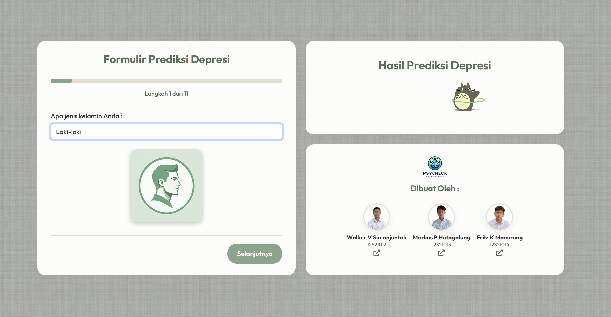

<div align="center">
  
  
  <br>
  
  # **Data Mining: Explore Mental Health Data**
  
  [](https://www.python.org/)
  [](https://scikit-learn.org/)
  [](https://xgboost.readthedocs.io/)
  [](https://flask.palletsprojects.com/)
  
  Sebuah pendekatan komprehensif **CRISP-DM (Cross Industry Standard Process for Data Mining)** untuk memprediksi dan mendeteksi risiko kondisi kesehatan mental (depresi) berdasarkan rekam data survei.
</div>

---

## **1. Business Understanding**
### 🎯 **Objektif Bisnis**
Kesehatan mental, khususnya tekanan akademik dan pekerjaan yang dapat memicu depresi, semakin menjadi sorotan utama global. Proyek ini bertujuan untuk mengembangkan sistem _Machine Learning_ yang mampu mengenali **faktor utama penyebab risiko depresi** berdasarkan pola kebiasaan individu, jam kerja/belajar, stres finansial, dan riwayat kesehatan. Solusi ini diharapkan dapat menjadi fondasi awal deteksi dini pada lingkungan akademi maupun profesional.

---

## **2. Data Understanding**
### 📊 **Deskripsi Dataset**
Dataset diperoleh dari hasil survei anonim untuk memahami faktor-faktor pendorong risiko kesehatan mental pada orang dewasa. Terdiri dari **141.000 baris data latih (train)** dan **93.000 baris data uji (test)**, dengan **20 variabel** yang memiliki tipe data beragam.

- **Numerik**: `Age`, `CGPA`, `Work/Study Hours`
- **Kategorik**: `Gender`, `Working Professional or Student`, `Academic Pressure`, `Work Pressure`, `Study/Job Satisfaction`, `Sleep Duration`, `Dietary Habits`, `Financial Stress`, `Depression` (Target)
- **Teks Literal**: `Name`, `City`, `Profession`, `Degree`
- **Boolean**: `Have you ever had suicidal thoughts?`, `Family History of Mental Illness`

---

## **3. Data Preparation**
Proses pengolahan data mentah (CSV) agar siap dimasukkan ke dalam model ML tertuang di file _Jupyter Notebook_ (`Application/data-understanding.ipynb`).
* **Pembersihan Data (_Cleaning_)**: Mengatasi _missing values_ dan modifikasi _outliers_.
* **Pra-Pemrosesan (_Preprocessing_)**: Teknik encoding untuk data non-numerik (misal: merubah klasifikasi Jam Tidur menjadi indeks skor) dan eliminasi kolom nama/kota yang kurang berkorelasi (drop-feature).
* **Dataset Bersih**: Menghasilkan `train_clean.csv` dan `test_clean.csv` di direktori `Data`.

---

## **4. Modelling**
Berbagai model dikembangkan dan diukur dalam direktori `Application`. Model yang dikembangkan antara lain:
1. 🧠 **Neural Network (Multilayer Perceptron)** - Cenderung sensitif terhadap standar fitur.
2. 🌳 **Random Forest (RF)** - Metode _ensemble bagging_ yang tangguh menangani data tak linear.
3. 🚀 **XGBoost (Extreme Gradient Boosting)** - Model berbasis *boosting* terbaik dan sangat teliti.

✅ **Pemilihan Model**: Dari hasil evaluasi, **XGBoost** secara telak menunjukkan kombinasi performa akurasi dan kecepatan yang paling optimal, sehingga diekspor sebagai `xgb_model.pkl` untuk tahap _Deployment_.

---

## **5. Evaluation**
### 📈 **Analisis Hasil**
Berdasarkan prediksi XGBoost (disimpan pada `Data/xgb_pred.csv`), model sukses mempelajari pola klasifikasi orang yang mengalami tekanan (indikasi depresi) secara akurat berdasarkan interaksi kombinasi fitur: *Durasi Tidur* (Sleep Duration), *Stres Finansial*, *Diet*, serta *Faktor Genetik*. 

---

## **6. Deployment**
Model _machine learning_ terbaik kami (`xgb_model.pkl`) diintegrasikan langsung sebagai **Website Interaktif** menggunakan *framework* web **Flask**. Website ini meminta masukan data anonim dari pengguna di *Real Time* dan seketika mengeksekusi analisis probabilitas.

### 💻 Tampilan Aplikasi
> **Bantu Kami Melengkapi:** Anda bisa melihat gambar tangkapan layar (screenshot) aplikasi kami di bawah ini!
> _(Tempatkan file screenshot Anda bernama `app-screenshot.png` di folder `Document/img/` agar tampil secara otomatis di sini)_

<div align="center">
  
</div>

---

## 🛠️ **Instruksi Menjalankan Proyek**
Jika Anda ingin menjalankan atau mengembangkan proyek ini di komputer lokal secara mandiri:

### **Persyaratan Sistem**
* Python 3.9+
* Kloning repositori ini

### **Langkah Instalasi**
1. Masuk ke direktori repositori:
   ```bash
   cd Project-Data-Mining-Explore-Mental-Health
   ```
2. Instal semua pustaka yang dibutuhkan:
   ```bash
   pip install -r requirements.txt
   ```
   *Dependency Utama: `Flask==3.1.0`, `xgboost==2.1.3`, `scikit-learn==1.5.2`, `pandas`*

### **Menyalakan Aplikasi Web**
1. Buka folder Deployment:
   ```bash
   cd Deployment
   ```
2. Jalankan server **Flask**:
   ```bash
   python app.py
   ```
3. Buka peramban (browser) dan akses alamat: 👉 `http://127.0.0.1:8080/`

---
*Dikembangkan atas pendekatan ilmiah eksplorasi Data Mining berstandar CRISP-DM.*

