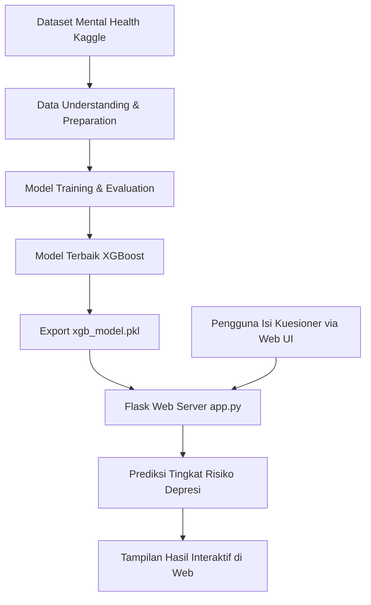

# PsyCheck

Sistem cerdas berbasis CRISP DM untuk deteksi dini risiko depresi yang dirancang dengan tampilan web interaktif, modern, dan menenangkan bagi pengguna.

## Tentang Proyek

Kesehatan mental kini menjadi perhatian penting bagi masyarakat global. PsyCheck hadir sebagai aplikasi analisis data yang mendeteksi kemungkinan awal risiko depresi berdasarkan pola hidup seseorang. Sistem ini memproses variabel seperti durasi tidur, jam kerja, beban finansial, hingga riwayat kesehatan keluarga. Dengan pendekatan ilmiah yang dikemas dalam bentuk survei interaktif, sistem ini berupaya menjadi sarana skrining mandiri yang nyaman, ramah pengguna, dan bebas dari kesan intimidasi.

## Fitur Utama

* **Penyatuan Halaman Web**: Penggabungan belasan berkas HTML terpisah ke dalam satu templat tunggal yang ringkas dan memuat data lebih cepat.
* **Estetika Sage Green**: Desain visual premium dengan warna hijau pastel lembut demi memberikan ketenangan psikologis saat pengisian data.
* **Visualisasi Ilustrasi Kustom**: Integrasi ilustrasi unik yang memadukan keindahan seni modern dengan humor halus untuk mengurangi ketegangan pengguna.
* **Prediksi Akurat XGBoost**: Penggunaan model kecerdasan buatan berbasis algoritma XGBoost untuk menghasilkan kalkulasi risiko depresi secara dinamis.

## Alur Kerja dan Arsitektur

Proyek ini dikembangkan dengan mengikuti siklus metode CRISP DM. Proses dimulai dari analisis masalah, dilanjutkan dengan pemahaman karakteristik data, pembersihan nilai kosong, pelatihan model klasifikasi, hingga penyerahan hasil akhir ke antarmuka web.


```mermaid
graph TD
    A[Dataset Mental Health Kaggle] --> B[Data Understanding & Preparation]
    B --> C[Model Training & Evaluation]
    C --> D[Model Terbaik XGBoost]
    D --> E[Export xgb_model.pkl]
    E --> F[Flask Web Server app.py]
    G[Pengguna Isi Kuesioner via Web UI] --> F
    F --> H[Prediksi Tingkat Risiko Depresi]
    H --> I[Tampilan Hasil Interaktif di Web]
```

## Struktur Proyek

Berikut adalah susunan direktori proyek yang dikelompokkan secara rapi:

```
MATKUL_DAMI_PSYCHECK/
├── Application/          # Notebook analisis dan file model latih
├── ArticleDraft/         # Draf publikasi ilmiah format jurnal
├── Data/                 # Kumpulan berkas dataset mentah dan bersih
├── Deployment/           # Implementasi aplikasi web berbasis Flask
│   ├── static/           # Berkas aset visual, CSS, dan JavaScript
│   └── templates/        # Halaman templat HTML utama
├── Document/             # Dokumentasi laporan proyek lengkap
├── requirements.txt      # Daftar dependensi pustaka Python
├── vercel.json           # Konfigurasi deploy ke platform Vercel
└── README.MD             # Dokumentasi utama proyek
```

## Teknologi yang Digunakan

Pengelompokan teknologi yang menopang sistem ini disajikan pada tabel di bawah ini:

| Kategori | Teknologi | Peran dan Deskripsi |
| :--- | :--- | :--- |
| Bahasa Pemrograman | Python | Bahasa utama untuk pengolahan data dan logika server |
| Framework Web | Flask | Server web mikro penyedia layanan antarmuka pengguna |
| Machine Learning | Scikit Learn, XGBoost | Pelatihan model klasifikasi dan kalkulasi probabilitas risiko |
| Analisis Data | Pandas, Numpy | Pembersihan data kotor serta operasi matriks |
| Desain Antarmuka | HTML, Vanilla CSS, JavaScript | Tampilan interaktif responsif bernuansa Sage Green |
| Hosting Serverless | Vercel | Media publikasi server agar dapat diakses secara online |

## Panduan Instalasi dan Penggunaan

Prosedur berikut menjelaskan cara menjalankan sistem ini pada lingkungan komputer lokal.

### Persyaratan Sistem

Sebelum memulai, pastikan komputer Anda telah dilengkapi dengan:
* Python versi 3.9 atau yang lebih baru
* Peramban internet seperti Google Chrome atau Mozilla Firefox

### Tahapan Pemasangan

1. Masuk ke dalam folder proyek utama:
   ```bash
   cd MATKUL_DAMI_PSYCHECK
   ```

2. Buat lingkungan virtual baru dan aktifkan:
   ```bash
   # Pembuatan lingkungan virtual
   python -m venv venv

   # Aktivasi di sistem operasi Windows menggunakan PowerShell
   .\venv\Scripts\activate.ps1
   ```

3. Pasang seluruh pustaka yang diperlukan:
   ```bash
   pip install -r requirements.txt
   ```

### Cara Menjalankan Aplikasi

1. Berpindah ke dalam folder rilis web:
   ```bash
   cd Deployment
   ```

2. Mulai jalankan server lokal:
   ```bash
   python app.py
   ```

3. Buka peramban internet lalu ketik alamat berikut:
   `http://127.0.0.1:8080/`

## Tim Pengembang

Berikut adalah daftar anggota kelompok yang merancang dan membangun sistem ini:

| Nama Lengkap | Peran Utama dalam Proyek |
| :--- | :--- |
| Walker Valentinus Simanjuntak | Pemodelan Machine Learning dan Evaluasi |
| Markus Pardianto Hutagalung | Analisis dan Persiapan Karakteristik Data |
| Fritz Kevin Manurung | Integrasi dan Deployment Aplikasi Web |

## Lisensi

Proyek ini dilisensikan di bawah naungan Creative Commons Attribution ShareAlike 4.0 International (CC BY SA 4.0).
